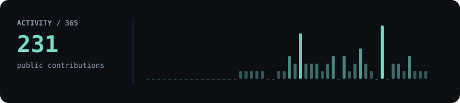

# Palash Pingale

### AI Engineer · Software Engineer

<samp>LLMs · RAG · Agentic AI · AI Automation</samp>

Building practical AI systems that reason, retrieve, use tools, and execute multi-step workflows.

## CURRENT FOCUS

**AI Engineer | LLMs · RAG · Agentic AI · AI Automation**

Building practical AI systems that **reason, retrieve, use tools, and execute multi-step workflows**. Experienced in **LLM applications, multi-agent orchestration, RAG, evaluation, and AI-powered backend systems** using Python.

**Python · LangGraph · LangChain · Google ADK · Gemini · Claude · RAG · pgvector · FastAPI · Django**

## FEATURED SYSTEMS

### 🧠 IncidentIQ
**Autonomous AI incident resolution system** built with LangGraph + Google ADK, using multi-step agent orchestration, vector retrieval, tool execution, and automated recovery workflows.

### 🤖 Sentinel
**Deterministic multi-agent system** with Triage, Diagnosis, Remediation, Guardrail, and Reflection agents, designed for controlled execution of complex AI workflows.

### 🔎 Nexus AI Knowledge Base
**Production-oriented RAG SaaS** built with Django, pgvector, Gemini embeddings, hybrid retrieval, semantic search, cross-encoder reranking, query rewriting, and hallucination detection.

### ✍️ AI Writing Assistant
**AI-powered Django REST API** providing writing, summarization, document Q&A, persistent memory, and structured LLM workflows through a clean backend architecture.

### ⚡ AI Automation Systems
**End-to-end AI automations** using n8n, Gemini, Claude, APIs, and agent workflows to turn repetitive processes into autonomous pipelines.

### 🧪 LLM Fine-Tuning
Hands-on experiments with **Hugging Face, fine-tuning, evaluation, and model adaptation**, exploring specialized model performance.

## WHAT I BUILD

`LLM Applications` · `RAG Systems` · `AI Agents` · `Multi-Agent Orchestration` · `AI Automation` · `LLM Evaluation` · `Backend APIs` · `Vector Search` · `Mobile Applications`

## ENGINEERING STACK

**AI / LLM:** Python · LangChain · LangGraph · Google ADK · Gemini · Claude · Prompt Engineering · RAG · MCP · n8n

**ML / Deep Learning:** PyTorch · Scikit-learn · NumPy · Pandas · Transfer Learning · Computer Vision · Model Fine-Tuning

**Backend:** Django · Django REST Framework · FastAPI · REST APIs · PostgreSQL · MySQL · Redis · Celery

**Vector Search & Data:** pgvector · MongoDB Atlas Vector Search · Embeddings · Hybrid Search · Semantic Search · Cross-Encoder Reranking

**Mobile:** Flutter · Dart · Bloc · Provider · GetX · Clean Architecture · Firebase · Razorpay

**Cloud / DevOps:** Docker · AWS · Oracle Cloud Infrastructure · Railway · Git · GitHub · GitHub Actions

**AI Systems:** Agentic AI · Multi-Agent Systems · AI Automation · LLM Evaluation · Hallucination Detection · Structured Outputs · Tool Calling

<samp>PRODUCTION SOFTWARE BACKGROUND</samp>

Flutter applications including PlottingWala, VyapariApp, DMFU, and Attendsync.

## GITHUB SIGNAL

Generated in this repository with GitHub's API. No third-party widgets.

  

<a href="https://github.com/Palash-P">github.com/Palash-P</a>
